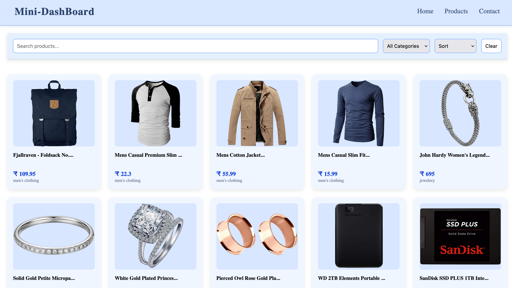

#  Mini Product Dashboard

> A clean, responsive product dashboard built with React for a frontend internship assignment. It features real-time search, filtering, sorting, and a modal for product details.

<br>

[**Click Here for Live Demo**]('https://frontend-intern-assignment-a2jg.vercel.app/')

<br>

---



---

## 🚀 Core Features

*  Live Search:** Instantly filters products as you type.
*  Category Filter:** A dynamic dropdown built from API data.
*  Price Sorting:** Sort products by price (Low-High or High-Low).
*  Product Modal:** Click any product to see a full-detail modal.
*  Skeleton Loader:** A modern, professional loading state—no "Loading..." text.
*  Fully Responsive:** A clean, mobile-first design that looks great on all devices.

---

## Tech Stack & Tools

| Technology | Description |
| :--- | :--- |
| **React** | Core library for building the user interface. |
| **Vite** | Next-generation build tool for a fast dev experience. |
| **React Hooks** | Used `useState` and `useEffect` for state and API handling. |
| **CSS Grid & Flexbox** | For building the complex, responsive layouts. |
| **Fake Store API** | Used as the data source for all products. |
| **Git & GitHub** | For version control. |
| **Vercel** | For seamless deployment and hosting. |

---

## How to Run Locally

To get a local copy up and running, follow these steps.

1. Clone the Repository
```bash
git clone [https://github.com/NikitaPpareek/frontend-intern-assignment.git](https://github.com/NikitaPpareek/frontend-intern-assignment.git)

2. Navigate to the Directory
cd frontend-intern-assignment

3.Install Dependencies
npm install

4.Run the Development Server
npm run dev
The app will be running at http://localhost:5173
